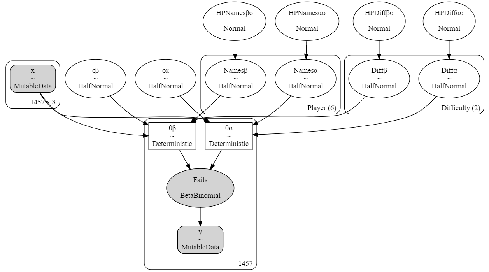
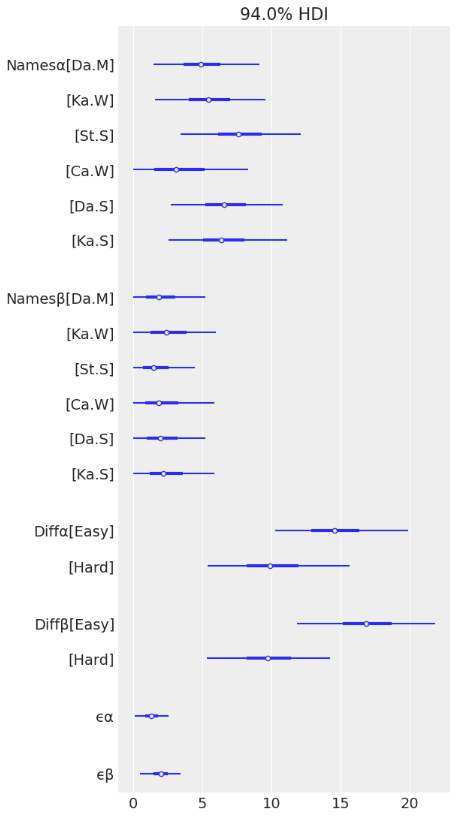

# wordle-analysis

The goal of this project is to model my own and my friends performance playing Wordle. 

Wordle is a free game available at [nytimes.com/games/wordle](https://www.nytimes.com/games/wordle/index.html).
The object of the game is to guess a word within 6 tries.

This repository contains the scripts that process and model the data: 

1. ProcessWordle.py creates an organized .csv of player's Wordle scores from a WhatsApp Chat backup.txt.
2. BetterBinomial.ipynb models the distribution of fails using a BetaBinomial (via PYMC). 

After some experiementation, I arrived at a mostly satisfactory model: 

This model yielded the below parameter values: 

The code for the app is located in the [wordle-app](https://github.com/DJSherwood/wordle-app) repository.